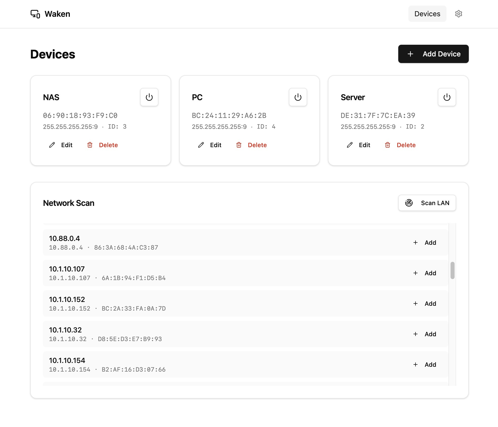

# Waken



Wake-on-LAN web application. Go backend with embedded React frontend, running in a single binary.

Supports device management via web UI and direct HTTP API calls with Bearer token authentication.

## Quick Start

```yaml
# docker-compose.yml
services:
  waken:
    image: ghcr.io/channinghe/waken:latest
    network_mode: host
    volumes:
      - ./config:/app/waken/config
    environment:
      - WOL_PORT=19527
      - WOL_AUTH_TOKEN=your-secret-token
      #- WOL_DB_PATH=/app/waken/config/wol.db
    restart: unless-stopped
```

```bash
docker compose up -d
```

Open `http://localhost:19527` to access the web UI.

`network_mode: host` is required for UDP broadcast packets to reach the local network.

## API

All endpoints except `/api/health` require `Authorization: Bearer <token>` header.

Device ID is a deterministic 8-char hex string derived from MAC address (e.g. `a3f2b109`). Device name must be unique.

### Endpoints

```
GET    /api/health              Health check (no auth)
GET    /api/devices             List all devices
POST   /api/devices             Add device
PUT    /api/devices/{id}        Update device
DELETE /api/devices/{id}        Delete device
POST   /api/wake/{id}           Wake device by ID
POST   /api/wake/name/{name}    Wake device by name
POST   /api/wake                Wake by MAC address (direct)
GET    /api/scan                Scan LAN for devices (reads ARP table)
```

### Wake by ID

```bash
curl -X POST http://localhost:19527/api/wake/a3f2b109 \
  -H "Authorization: Bearer your-secret-token"
```

### Wake by Name

```bash
curl -X POST http://localhost:19527/api/wake/name/Gaming-PC \
  -H "Authorization: Bearer your-secret-token"
```

### Wake by MAC (direct)

```bash
curl -X POST http://localhost:19527/api/wake \
  -H "Authorization: Bearer your-secret-token" \
  -H "Content-Type: application/json" \
  -d '{"mac": "AA:BB:CC:DD:EE:FF"}'
```

## Environment Variables

| Variable | Default | Description |
|---|---|---|
| `WOL_PORT` | `19527` | HTTP listen port |
| `WOL_AUTH_TOKEN` | empty (auth disabled) | Bearer token |
| `WOL_BROADCAST_ADDR` | `255.255.255.255` | Default broadcast address |
| `WOL_WOL_PORT` | `9` | Default WoL UDP port |
| `WOL_DB_PATH` | `/app/waken/config/wol.db` | SQLite database path |

## License

MIT
